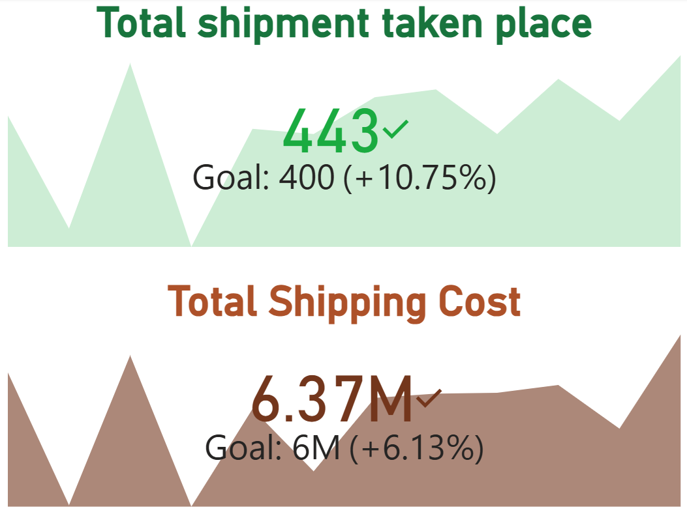

# 🚚 Supply Chain Disruption Risk Analytics Dashboard

## 📊 Project Overview

An interactive Power BI dashboard developed to analyze supply chain disruption risks across shipments, suppliers, products, inventory, and warehouses.

The dashboard helps identify potential supply chain risks, monitor operational performance, and support data-driven decision-making.

## 🛠️ Tools & Technologies

* Power BI
* Power Query
* DAX
* Data Modeling
* Data Cleaning & Transformation
* Data Visualization

## 📁 Dataset Structure

The project contains multiple fact and dimension tables, including:

* Fact_Shipments — 5,000+ shipment records
* Dim_Suppliers — 200 suppliers
* Dim_Products — 400 products
* Fact_Inventory — 1,200 inventory records
* Dim_Warehouse — 20 warehouses

## 📈 Dashboard Analysis

The dashboard provides insights into:

* Shipment performance
* Supply chain disruption risks
* Supplier performance
* Inventory levels
* Product performance
* Warehouse performance
* Risk distribution
* Key operational KPIs

## 🔍 Key Skills Demonstrated

* Data Cleaning
* Data Transformation using Power Query
* Data Modeling
* DAX Measures
* KPI Development
* Interactive Dashboard Design
* Risk Analysis
* Business Insights
## Dashboard Preview

### Dashboard Overview

### Shipment Analysis

### Inventory Analysis

### Risk Analysis

### Tooltip

## 🎯 Project Objective

To use data analytics and visualization techniques to identify supply chain risks and provide actionable insights into shipments, inventory, suppliers, products, and warehouse operations.
